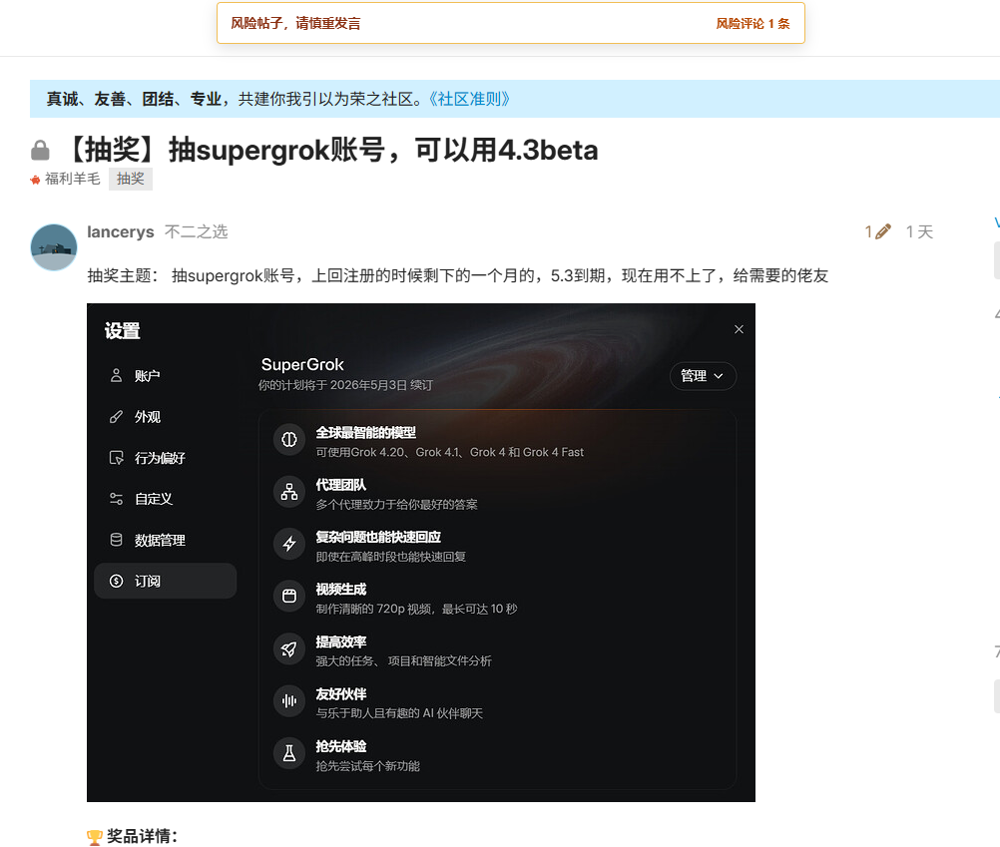

# linuxdo-lottery-risk-monitor
给你一个有效戒掉“在Linux.do看到抽奖贴就想发帖”的插件！

你还在为抽奖贴的恶意举报而苦恼吗！ 
你还在为抽奖贴被人善意“非必要不抽奖”而喜提举报吗！ 
现在！你不用担心！你面前有一个有效戒掉“看到抽奖贴就想发帖”的插件！ 
他会扫描当前的抽奖帖子！如果有人被举报，则提醒“风险贴子，请谨慎发言！风险评论X条！” 
还会每隔15秒再扫描一次刚才看过的贴子！提醒你！你刚才没有发言是对的！你差点中了陷阱！ 
并且！他还让你看清！几乎！百分百！每一个抽奖贴！必定会有一个超级无敌大善人！ 
给你一个善意“非必要不抽奖”举报！ 

看到没！这就是你想要的抽奖贴子盛况！NEO！什么“非必要不抽奖”！我看就是个大型钓鱼贴子罢了！
只要不符合你们“非必要不抽奖”的定义而统统被举报，而你所谓的“非必要不抽奖”是怎样定义呢？你手下的人可是完全曲解这意思呀！

